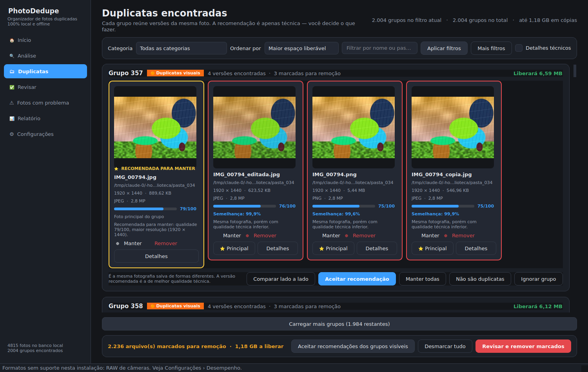
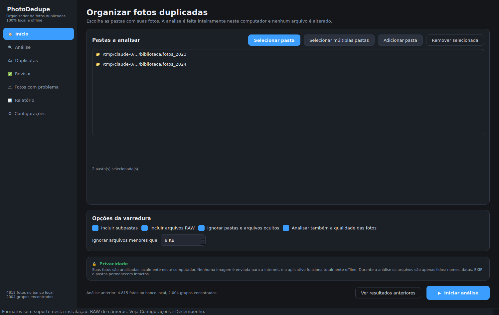
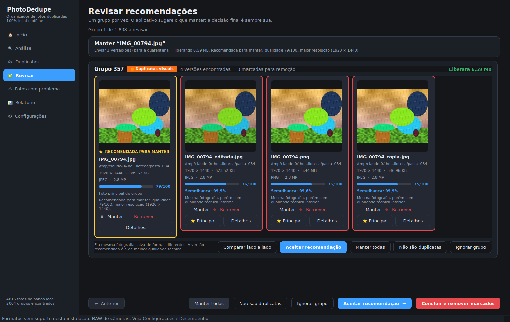
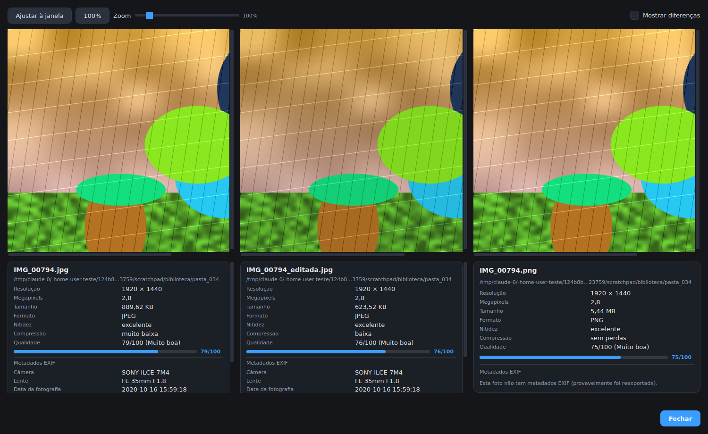
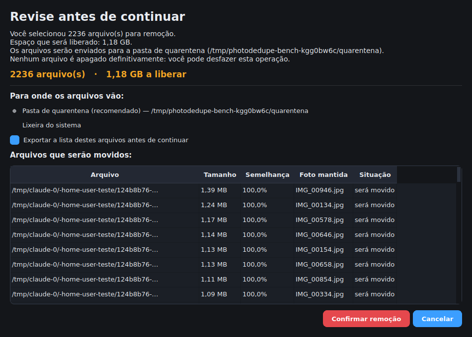
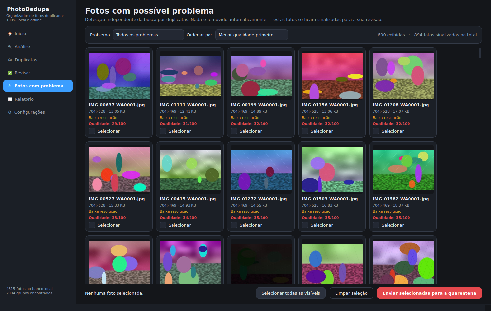
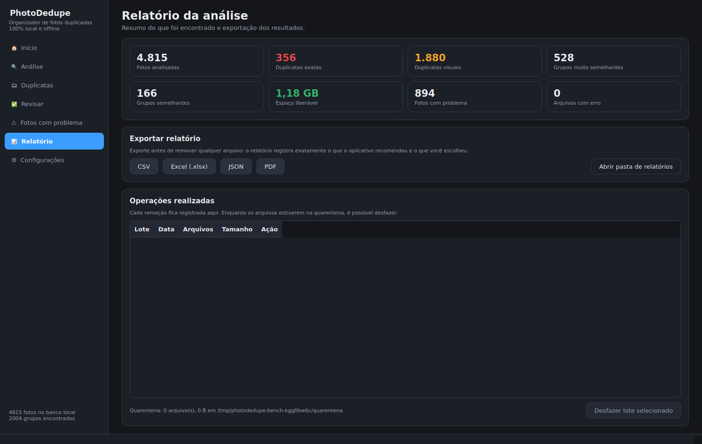

# PhotoDedupe — Organizador de Fotos Duplicadas

Aplicativo desktop para **localizar e organizar fotos duplicadas** em bibliotecas locais
grandes (milhares ou centenas de milhares de imagens). Funciona **totalmente offline**:
nenhuma foto sai do seu computador.

> **Segurança em primeiro lugar.** O aplicativo nunca apaga, move, renomeia ou modifica
> uma foto sem confirmação explícita. Durante a análise, os arquivos são apenas **lidos**.



<details>
<summary><b>Mais telas</b> (clique para abrir)</summary>

| | |
|---|---|
| **Início — escolha das pastas**<br> | **Revisar recomendações**<br> |
| **Comparação lado a lado**<br> | **Confirmação antes de remover**<br> |
| **Fotos com problema**<br> | **Relatório e histórico**<br> |

</details>

---

## O que ele faz

| Nível | O que encontra | Como |
|-------|----------------|------|
| 🔴 **Duplicatas exatas** | arquivos idênticos byte a byte | SHA-256 do arquivo inteiro |
| 🟠 **Duplicatas visuais** | a mesma foto recompactada, redimensionada, convertida de formato, com brilho alterado ou reexportada | pHash, dHash, aHash, wHash + descritor visual + correlação estrutural |
| 🟡 **Fotos muito semelhantes** | recortes, edições e variações da mesma imagem | comparação do recorte central + análise combinada |
| 🔵 **Fotos semelhantes** | imagens relacionadas que **provavelmente não são** duplicatas | mesma análise, com pontuação mais baixa |

Além disso:

- **Índice de qualidade 0–100 explicável** para cada foto (resolução, nitidez, compressão,
  formato, EXIF, tamanho e indícios de originalidade), com a melhor versão marcada com ⭐;
- **comparação lado a lado** com zoom sincronizado, EXIF e mapa de diferenças;
- **detecção de fotos com problema** (desfocadas, escuras, superexpostas, corrompidas,
  minúsculas, capturas de tela e imagens que não parecem fotografias);
- **relatórios** em CSV, Excel, JSON e PDF;
- **quarentena com desfazer**: nada é apagado de verdade.

---

## Como a detecção evita falsos positivos

Duas fotos tiradas em sequência são visualmente parecidíssimas, mas **não são duplicatas**.
O PhotoDedupe trata isso combinando evidências independentes e sendo conservador:

- compara **três famílias de sinais** (hashes perceptuais, descritor visual e correlação
  estrutural) — nenhum sinal isolado decide;
- **instantes de captura diferentes no EXIF** limitam a similaridade: são fotos distintas;
- **proporções diferentes ou indício de recorte** impedem a classificação como duplicata;
- **câmeras diferentes** e **imagens com pouca textura** reduzem a confiança;
- cada foto entra apenas no grupo do seu **melhor par**, e não do primeiro que a encontrar;
- só as categorias 🔴 e 🟠 recebem sugestão de remoção; 🟡 e 🔵 ficam para revisão manual.

Medido em uma biblioteca de teste com 4.815 fotos e gabarito conhecido
(`tools/gerar_biblioteca.py`):

| Métrica | Resultado |
|---------|-----------|
| Duplicatas exatas encontradas | **100,0%** (356/356) |
| Duplicatas visuais encontradas | **99,8%** (1.768/1.772) |
| Falsos positivos (cenas distintas agrupadas como duplicata) | **0** |
| Fotos em sequência (rajada) tratadas como duplicata | 3 de 716 (0,4%) — nenhuma sugerida para remoção |
| Cenas que perderiam todas as fotos ao aplicar **todas** as recomendações | **0** |
| Velocidade (4 processos, fotos de 1–3 MP) | ~25 fotos/s |
| Pico de memória | 220 MB |
| Banco de dados | ~6 KB por foto |
| Segunda análise da mesma pasta, sem mudanças | 0,1 s |

Reproduza com:

```bash
python tools/gerar_biblioteca.py --saida /tmp/biblioteca --originais 1600 --limpar
python tools/benchmark.py --biblioteca /tmp/biblioteca --processos 4
```

---

## Instalação no Windows (usuário final)

1. Baixe `PhotoDedupe-1.0.0-instalador.exe`.
2. Execute o instalador (não é preciso ser administrador: a instalação é por usuário).
3. Abra o **PhotoDedupe** pelo menu Iniciar.

Não é necessário instalar Python, Node.js ou qualquer outra dependência — está tudo
embutido no executável. A desinstalação fica em *Configurações › Aplicativos* do Windows
ou no atalho “Desinstalar PhotoDedupe”; o desinstalador **nunca apaga suas fotos** nem a
pasta de quarentena.

### Onde ficam os dados

| Conteúdo | Local |
|----------|-------|
| Banco de dados, miniaturas, logs | `%LOCALAPPDATA%\PhotoDedupe` |
| Quarentena (arquivos removidos) | `%LOCALAPPDATA%\PhotoDedupe\quarentena` |
| Relatórios exportados | `%LOCALAPPDATA%\PhotoDedupe\relatorios` |

---

## Executando a partir do código-fonte

Requer **Python 3.10 ou superior**.

```bash
git clone https://github.com/PatrickAMSoares/teste.git
cd teste

python -m venv .venv
# Windows:
.venv\Scripts\activate
# Linux/macOS:
source .venv/bin/activate

pip install -r requirements.txt
pip install -e .

python -m photodedupe          # abre a interface gráfica
```

### Dependências

Obrigatórias: **PySide6** (interface), **NumPy** e **Pillow** (imagem).

Opcionais — o aplicativo funciona sem elas, com recursos reduzidos:

| Pacote | O que habilita |
|--------|----------------|
| `pillow-heif` | fotos HEIC/HEIF (iPhone) |
| `rawpy` | arquivos RAW (CR2, NEF, ARW, DNG…) |
| `opencv-python-headless` | acelera nitidez e redimensionamento |
| `send2trash` | enviar para a Lixeira do Windows |
| `openpyxl` | relatório em Excel |
| `reportlab` | relatório em PDF |

O que está disponível aparece em **Configurações › Desempenho**.

---

## Linha de comando

```bash
photodedupe-cli analisar "D:\Fotos" "E:\Backup\Fotos"   # analisa as pastas
photodedupe-cli status                                  # resumo do banco local
photodedupe-cli relatorio relatorio.pdf                 # csv | xlsx | json | pdf
photodedupe-cli plano --exportar plano.csv              # mostra o que seria removido
photodedupe-cli plano --confirmar                       # executa (quarentena)
photodedupe-cli desfazer 20260101-101500-a1b2c3         # desfaz um lote
```

Sem `--confirmar`, **nada é movido**.

---

## Compilando o instalador do Windows

Em uma máquina Windows com Python 3.10+:

```powershell
powershell -ExecutionPolicy Bypass -File packaging\build_windows.ps1
```

O script cria o ambiente virtual, instala as dependências, roda os testes, gera
`dist\PhotoDedupe\PhotoDedupe.exe` (PyInstaller) e, se o
[Inno Setup 6](https://jrsoftware.org/isdl.php) estiver instalado, também
`dist\instalador\PhotoDedupe-1.0.0-instalador.exe`.

Opções: `-PularTestes` (não roda a suíte) e `-SomenteExe` (não gera o instalador).

Etapas manuais, se preferir:

```powershell
pyinstaller packaging\photodedupe.spec --noconfirm --clean
ISCC.exe packaging\installer.iss
```

---

## Testes

```bash
pip install -r requirements-dev.txt
pytest -q                     # suíte completa (inclui a interface, em modo offscreen)
pytest tests/test_fileops.py  # somente as operações de arquivo
ruff check src tests tools    # análise estática
```

A suíte cobre hashes, decodificação, EXIF, índice de qualidade, similaridade,
agrupamento, detecção de fotos ruins, banco de dados (inclusive migração de esquema),
operações de arquivo, pipeline, relatórios e as telas da interface.

---

## Fluxo de uso

1. Escolha uma ou várias pastas e clique em **Iniciar análise** (pode pausar e retomar).
2. Acompanhe progresso, velocidade, tempo restante e duplicatas encontradas.
3. Revise os grupos em **Duplicatas** (ou um a um em **Revisar**).
4. Ajuste o que manter — a foto ⭐ é apenas uma recomendação técnica.
5. Clique em **Revisar e remover marcados**: uma tela mostra a quantidade de arquivos,
   o espaço a liberar e o destino, e pede confirmação.
6. Os arquivos vão para a **quarentena** (ou para a Lixeira, se você preferir).
7. Precisou voltar atrás? **Relatório › Desfazer lote**.

---

## Privacidade

- As fotos são analisadas **localmente**; nenhuma imagem é enviada para a internet.
- O aplicativo **funciona offline** e não usa serviços de nuvem.
- Nenhuma funcionalidade externa está ativa. Se alguma existir no futuro, será opcional
  e informará qual serviço, quais dados, por que são necessários e como desativá-la.
- Coordenadas de GPS do EXIF só aparecem se você ativar a opção nas configurações.
- Se quiser usar um modelo de IA próprio, aponte um arquivo **ONNX local** nas
  configurações — ele roda na sua máquina, como todo o resto.

---

## Documentação

- [`docs/ARQUITETURA.md`](docs/ARQUITETURA.md) — arquitetura, algoritmos e esquema do banco.
- [`docs/SEGURANCA.md`](docs/SEGURANCA.md) — todas as garantias de preservação dos arquivos.

## Licença

MIT — veja [LICENSE](LICENSE).
